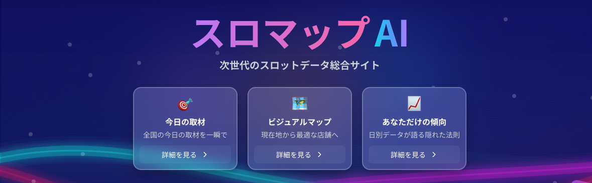
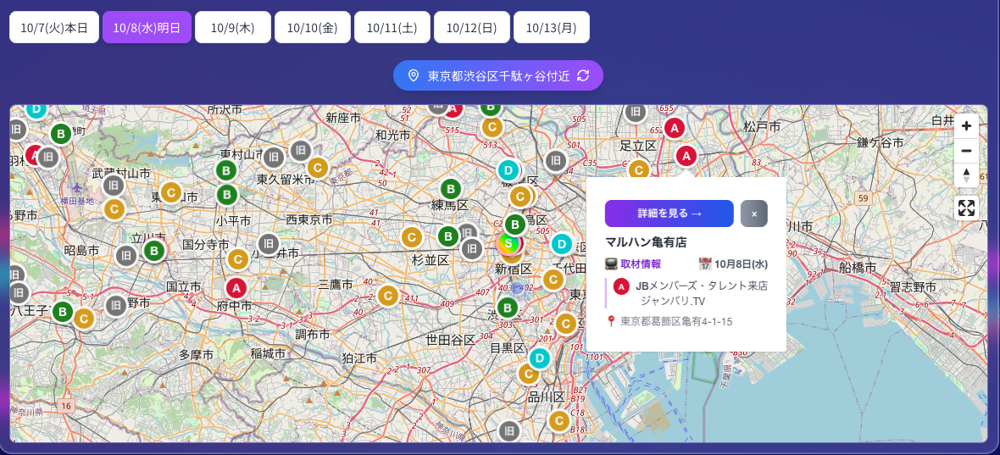

## 📊 GitHub統計

※ 全期間の累積データです。最近は TypeScript × Next.js × Supabase × Vercel で開発中 🚀

## 🔥 連続コミット記録

# 採用担当者の方へ。お読みいただきありがとうございます！

## 🚀 自己紹介

**個人開発 💻 とおしゃべり ☕ とテニス 🎾 が好きなプロダクトがグロースすることに喜びを感じるエンジニアです 🚀**

- **個人開発**: 2025年7月より再挑戦中、Next.js × Supabase × Claude Code MAX ✖︎20プランでどこまでできるか挑戦中
- **おしゃべり**: 無限にできます（なんでも）
- **テニス**: テニス歴20年、テニスコーチ経験あり。ダブルスガチ勢　週末はよく外でテニスしています🎾

**「生成AI技術とマーケティングと技術をバランスよく理解してどこまでできるかを挑戦して楽しむエンジニアを目指しています」**

**エンジニア職務経歴（2020-2025 | Python歴5年 Javascript歴 2年| 転職活動中）**:
- **AWS Bedrock API開発**、Django/Flask/FastAPI での実務経験
- **1000万行超のデータ分析**、7000万レコード規模のDB設計・最適化
- 要件定義〜運用まで一貫して担当できるフルサイクル開発経験
- **テストは苦手です**

**現在取り組んでいること**:
- **Claude Code MAX ✖︎20** + Cursor で実務でDjangoで社内用CMSやAIを使った文章校正ツールなど開発中(要件定義~保守運用)
- 個人開発では TypeScript × Next.js × Supabase × Vercelに夢中、モダンフロントエンド開発を追求中
- TypeScript製の生成AIフレームワーク「Mastra」でRAG・マルチエージェントシステムで明日のオススメのパチンコ店のレコメンドシステムを開発予定
- 現在はAIreadyのためのパチンコ業界のデータをPythonで網羅的に取得中(seleniumでスクレイピング中心)

### 📈 プロダクトグロースの実績（エンジニアとしての差別化要素）

**個人開発**:
- **[スロマップAI](https://slo-map.com)**: Google AdSense収益化達成 25年8月MVPリリース、現在月間PV6万PV~
- **[個人ブログ](https://slotana777.com)**: 月間20万PV（PythonでREST APIを使ってSeleniumでスクレイピングしたデータを使って記事作成・投稿を完全自動化）

**実務（2016-2024 | 株式会社ZIZAI）**:
- **YouTubeディレクター2年担当**: 登録者数0→168万人（パチンコ業界No.1チャンネル/スロパチステーションの初代ディレクターを担当、自分が作成した動画の最高再生数は1本で1000万回越え）
- **SNSマーケティング含む企画職3年経験**: 商材の企画からLINE@やXなどマーケティング担当や社内デザインを担当(adobeXD,Photoshopも使えます)
- **Pythonを用いた社内業務全体の効率化を4年担当**: 年間3000時間以上削減し表彰を獲得（社内用webアプリ/RPA/Windows用GUI開発）

## 🏆 GitHubトロフィー

## 🤖 Claude Code開発スタイル

### 開発環境・ツール
- **Claude Code MAX ✖︎20 v2.0.28 + Sonnet 4.5** で実務で開発中
- Cursor（1.5年経験）との併用でハイブリッド開発
- **Git worktree**で複数ブランチを並行開発（複数Claude Codeセッションを同時起動）

### 使用中のMCP (Model Context Protocol)
- **Chrome DevTools**: ブラウザ自動操作、スクリーンショット取得
- **Serena**: コードベース解析、シンボル検索、リファクタリング支援
- **Supabase**: データベース操作、スキーマ管理、クエリ実行
- **IDE**: VS Code統合、診断情報取得
- **GA4 & Search Console**: 日々のSEO対策・アクセス解析に活用

**主な実績**:
- **スロマップAI**: 92%の開発時間削減（Issue #392解決、Slug品質管理Agent、Sentry統合等）
- **実務プロジェクト**: Django + AWS Bedrock APIでRAGチャットボット・AI文章校正ツール開発
- **自動化Agent Bot**: GitHub Actions + Gemini による自動化システム構築

高市早苗氏が「馬車馬の如く働く」と宣言した2025年、私は生成AIという強力なパートナーに馬車馬の如く働いてもらい、自分自身も技術を磨き続けることで、**1人のエンジニアが生み出せる価値を飛躍的に高め、チーム全体の開発効率を最大化する**アプローチを実践しています。

**今後の展望**: この「AI駆動開発」のノウハウをチームに還元し、**エンジニアと生成AIの協業を組織として模索する企業で成長したい**と考えています。

## 🛠️ 技術スタック

### バックエンド・データベース

### AI・開発ツール

### フロントエンド

### クラウド・プラットフォーム

## 🌟 個人開発プロジェクト・実績

> 📌 **個人開発の詳細は[ピン留めされているリポジトリ](https://github.com/dataanalytics2020/slomap-ai-portfolio)からご覧ください**

### 🚀 [スロマップAI](https://slo-map.com) | [ポートフォリオ](https://github.com/dataanalytics2020/slomap-ai-portfolio)
> Next.js + Supabase で構築したパチンコ・スロット店舗情報プラットフォーム（**Google AdSense収益化達成**）
> **Pythonバックエンド**でデータパイプライン・スクレイピング基盤を構築

トップ画面 - Next.js 15 + Supabase で構築

マップ表示 - 店舗検索・フィルタリング機能

**技術スタック**: Next.js 15, React 19, TypeScript, Supabase, Python, Tailwind CSS

**主な成果**:
- 🎯 **Lighthouse Score**: 95+/100（モバイル・デスクトップ）
- 📈 **LCP改善**: 68%高速化（3.8秒 → 1.2秒）
- 🗄️ **データベース最適化**: 99%クエリ速度向上（5,200ms → 50ms）
- 🔍 **SEO対策**: Google Search Console インデックス登録率98.7%、構造化データ実装
- ✨ **コード品質**: TypeScript strict mode、ESLintエラー0件

**技術的ハイライト**:
- **Claude Code**を活用した開発効率化（92%時間削減を実現）
- Server Components + ISR でキャッシュヒット率92%達成
- Row Level Security (RLS) によるデータベース保護
- N+1問題解消（93%削減）
- Supabaseスキーマからの自動TypeScript型生成
- AI Agent開発による自動化（Slug品質管理、エラー分析等）

---

### 💼 実務での主な実績（2016-2024 | 株式会社ZIZAI）

#### 🤖 AI・自動化開発
- **AWS Bedrock API開発**（Django実装、RAGチャットボット構築）
- **業務効率化ツール開発**: 年間3000時間削減（RPA、自動画像生成、記事作成自動化）
- **REST API開発**（Lambda + API Gateway、画像生成機能）

#### 📊 データ分析・DB設計
- **大規模データ分析**: 1000万行以上のデータ集計・加工・分析
- **レコメンド機能開発**: 7000万レコードのDB設計、記述統計によるルールベースアルゴリズム（PoCまで）
- **Webスクレイピング専門**: Selenium/BeautifulSoup/Appiumを駆使した複雑なデータ収集
  - 動的サイト、SPA、ネイティブアプリ（4サイト+アプリからのデータ収集実績）
  - 認証突破、CAPTCHA回避、アンチボット対策など高度なスクレイピング技術

#### 📈 プロダクトグロース実績
- **YouTube運営**: 登録者数0→168万人に成長（パチンコ業界No.1メディアに育成）
  - エンジニア転向前: 動画ディレクターとして0からチャンネル立ち上げ
  - エンジニア転向後: Python自動化ツールでさらに成長加速
- **[個人ブログ運営](https://slotana777.com)**: 月間20万PVのメディア運営
  - エンジニア1年目でPython自動記事更新プログラムを開発
  - Selenium + WordPress API による記事作成・投稿の完全自動化
  - SEO最適化、コンテンツ戦略で安定したトラフィック獲得
- **SNSマーケティング**: Twitter自動化ツール開発（30人の手作業を完全自動化）

---

*「怠惰を求めて勤勉に行き着く」― 勝負師伝説 哲也*

